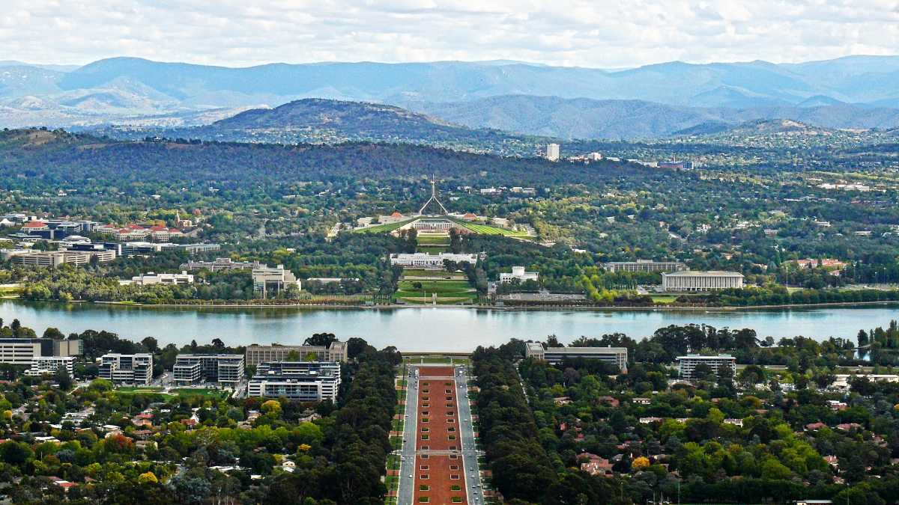

# Canberra

Canberra ist die Haupstadt Australiens. Sie liegt, im Gegensatz zu den anderen Großstädten Australiens nicht an der Küste sondern im Landesinneren \(248 km südöstlich von Sydney\) 

## Geschichte

Nachdem sich die beiden größten Stadte Australiens nicht einigen konnte, wer Hauptstadt sein sollte, entschied das Parlament sich für den Neubau einer Hauptstadt -> Canberra
* Stadtgründung 13. März 1913 \(nach einem internationalen Architekten Wettbewerb, den der amerikanische Architekt Walter Burles Griffin gewann\)
* seit 09. Mai 1927 Hauptstadt Australiens
* Fläche 814,2 km &sup2;
* Einwohner 395.790 \(Stand 2016\)

## Sehenswürdigkeiten

* Old Parliament House \(das "alte" Parlament\)
* New Parliament House
* Lake Burley Griffin \(der große See in der Mitte der Stadt\)
* National Gallery of Australia \(Kunstmuseum\)
* National Portrait Gallery
* War Memorial
* Canberra Museum and Gallery \(Geschicht von Canberra und div. Ausstellungen\)
* Mount Ainslie Lookout \(Aussichtspunkt auf dem Mount Ainslie\)
* Australian National Botanic Gardens
* Nationalparks in der Umgebung von Canberra z.B.
  * Tidbinbilla Nationalpark
  * Namadgi National Park
  * Booroomba Rocks

## Tipps

Tipp 1: Einen sehr guten Überblick über die Stadt bekommt man vom Mount Ainslie.
Tipp 2: Das "Old Parliament House" ist ein sehenswertes Demokratie-Museum.
Tipp 3: Vom Dach des "New Parliament House" hat man auch einen guten Blick über die Stadt
Tipp 4: Die meisten Museen kosten keinen Eintritt

## Bild

